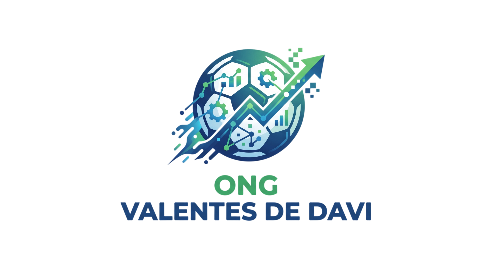
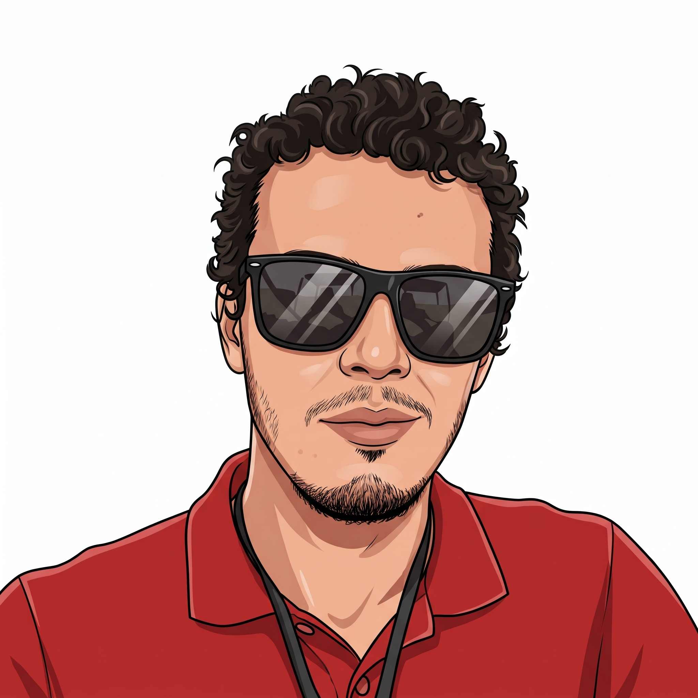
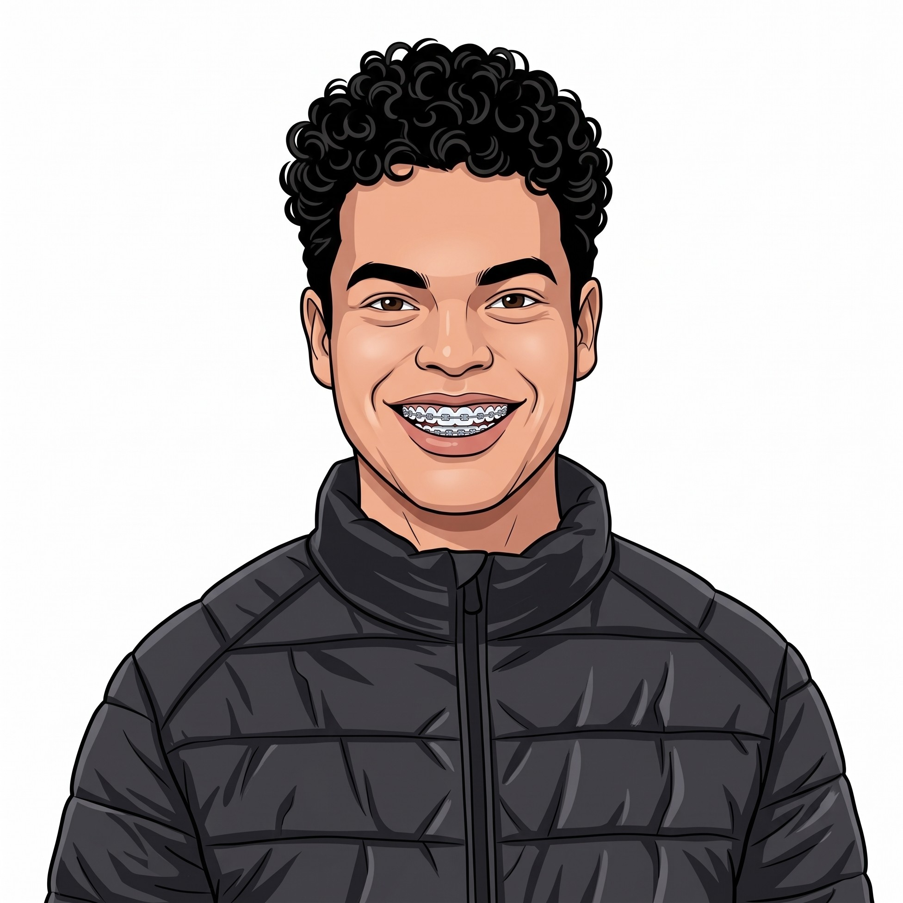

<table align="center" width="100%">
  <tr>
    <td align="center" width="20%">
      <a href="#o-grupo"><b>O GRUPO</b></a>
    </td>
    <td align="center" width="20%">
      <a href="#os-fundamentos"><b> OS FUNDAMENTOS</b></a>
    </td>
    <td align="center" width="20%">
      <a href="#o-projeto"><b>O PROJETO</b></a>
    </td>
    <td align="center" width="20%">
      <a href="#o-backlog"><b>O BACKLOG</b></a>
    </td>
    <td align="center" width="20%">
      <a href="#o-manual"><b>O MANUAL (GIT)</b></a>
    </td>
    <td align="center" width="20%">
      <a href="#licenca"><b>LICENÇA</b></a>
    </td>
  </tr>
</table>

--- 

>**FACULDADE:** Fatec Franca - Faculdade de Tecnologia de Franca Dr Thomaz Novelino

>**CURSO:** ADS (Análise e Desenvolvimento de Sistemas) 

>**PERÍODO:** Noturno / 3° Semestre

>**MATÉRIA:** Gestão de Projetos Ágeis 

>**PROFESSOR:** Leonardo Araújo Batista 

---
<a id="o-grupo"></a>
### O GRUPO

<table align="center">
  <tr>
    <td align="center" width="180px">
      <br>
      <b>Vitor Gabriel Dos Reis Glegorio</b><br>
      <sub>P.O / Backend</sub>
    </td>
    <td align="center" width="180px">
      <br>
      <b>Vinicius de Souza Salviano</b><br>
      <sub>Banco de Dados</sub>
    </td>
    <td align="center" width="180px">
      <br>
      <b>Khelvin Willian Barbosa Ribeiro</b><br>
      <sub>Banco de Dados</sub>
    </td>
    <td align="center" width="180px">
      <br>
      <b>Luís Felipe Carvalho de Souza</b><br>
      <sub>Frontend</sub>
    </td>
    <td align="center" width="180px">
      <br>
      <b>Brendon Heitor Bessa Silva</b><br>
      <sub>Frontend</sub>
    </td>
  </tr>
</table>

---
<a id="os-fundamentos"></a>
### OS FUNDAMENTOS

<table>
  <tr>
    <td width="33%" valign="top" align="justify">
      <h3>Missão</h3>
      <p>Contribuir para a formação de caráter de crianças, promovendo um tempo de qualidade que combina lazer, aprendizado e o fortalecimento de valores éticos, preparando-as para um futuro mais consciente e promissor.</p>
    </td>
    <td width="33%" valign="top" align="justify">
      <h3>Visão</h3>
      <p>Expandir de forma sustentável as atividades do projeto para impactar positivamente um número crescente de crianças, levando as ferramentas do esporte, lazer e princípios éticos como meio de inclusão e desenvolvimento pessoal</p>
    </td>
    <td width="33%" valign="top" align="justify">
      <h3>Valores</h3>
      <p>Os valores fundamentais transmitidos às crianças são: o respeito aos colegas e aos pais, além do incentivo para que sonhem em se tornar adultos dignos e íntegros no futuro.</p>
    </td>
  </tr>
</table>

<div align="right">
  <a href="#top">Voltar ao Topo</a>
</div>

---
<a id="o-projeto"></a>
### O PROJETO

O presente projeto descreve o sistema desenvolvido por um grupo de estudantes do curso de Análise e Desenvolvimento de Sistemas da Faculdade de Tecnologia de Franca, designado para criar uma plataforma digital robusta e integrada, concebida para atender às necessidades estratégicas e operacionais da ONG Valentes de Davi. A solução visa modernizar a gestão interna e ampliar a visibilidade externa da organização, superando desafios como a gestão manual de dados, a baixa visibilidade de marketing e a vulnerabilidade na segurança das informações.

### OS OBJETIVOS

O projeto busca resolver as fraquezas identificadas na ONG (gestão manual, risco de segurança e baixa visibilidade online) através dos seguintes objetivos específicos:
- Digitalizar 100% do Processo de Cadastro: Eliminar formulários de papel, permitindo o preenchimento de dados do assistido e responsável, anexo de documentos digitais, geração e armazenamento do Termo de Responsabilidade e criação de matrícula única.
- Automatizar o Controle de Frequência: Fornecer aos Voluntários uma ferramenta digital para registrar presença/falta em aula de forma ágil.
- Habilitar a Gestão Proativa de Evasão: Criar mecanismos automáticos de alerta para a Diretoria, disparando notificações quando o aluno atinge um limite predefinido de faltas.

<div align="right">
  <a href="#top">Voltar ao Topo</a>
</div>

---
<a id="o-backlog"></a>
### O BACKLOG

O projeto segue um fluxo incremental estruturado em 6 etapas de desenvolvimento até a entrega da aplicação desktop final.

| Fase | Etapa | Descrição / Atividades | Status |
| :---: | :--- | :--- | :---: |
| **01** | **Modelagem de Dados** | Criação dos Diagramas Conceitual e Lógico (MySQL) | 🟢 Concluído |
| **02** | **Construção do Banco** | Geração do script DDL inicial e refinamento de tabelas | 🟡 Em Andamento |
| **03** | **Prototipagem UI** | Design e validação das telas desktop com os stakeholders | 🔴 A Fazer |
| **04** | **Desenvolvimento Frontend** | Implementação das interfaces e componentes visuais | 🔴 A Fazer |
| **05** | **Desenvolvimento Backend** | Conexão com banco de dados MySQL e teste do CRUD inicial | 🔴 A Fazer |
| **06** | **Sistema Final** | Integração completa, testes de aceitação e empacotamento | 🔴 A Fazer |

### Backlog de Funcionalidades (Módulos do Sistema)

#### 1. Módulo de Gestão de Cadastros e Matrículas
- [ ] **[RF01] Cadastro de Assistidos e Responsáveis:** Registro completo de dados pessoais, socioeconômicos e de contato.
- [ ] **[RF02] Anexo de Documentos Digitais:** Upload e armazenamento seguro de documentos comprobatórios.
- [ ] **[RF03] Termo de Responsabilidade:** Geração automática e armazenamento do documento assinado.
- [ ] **[RF04] Matrícula Única:** Módulo gerador de identificador único automático para cada aluno no sistema.

#### 2. Módulo de Controle de Frequência
- [ ] **[RF05] Diário de Classe Digital:** Interface simplificada para voluntários registrarem presença/falta de forma ágil.
- [ ] **[RF06] Histórico de Frequência:** Consulta de histórico individual e por turma de alunos.

#### 3. Módulo de Prevenção de Evasão e Gestão
- [ ] **[RF07] Regras de Evasão:** Configuração do limite predefinido de faltas toleradas por turma.
- [ ] **[RF08] Alertas Automáticos:** Disparo de notificações e relatórios de risco de evasão para a Diretoria da ONG.
- [ ] **[RF09] Dashboard Operacional:** Visão geral com estatísticas de matrículas, chamadas diárias e alunos em alerta.

#### 4. Módulo de Infraestrutura e Segurança
- [ ] **[RNF01] Autenticação e Perfis (RBAC):** Níveis de acesso diferenciados para Voluntários, Assistentes Sociais e Diretoria.
- [ ] **[RNF02] Persistência de Dados:** Conexão segura com banco MySQL e integridade referencial.

<div align="right">
  <a href="#top">Voltar ao Topo</a>
</div>

---
<a id="o-manual"></a>
### O MANUAL (REGRAS)

>Antes de digitar comandos, entenda os 4 termos principais usando uma analogia com jogos e edições de documentos:
>- Git (O "Save Point" local): É um programa instalado no seu computador. Ele funciona como o sistema de salvamento de um jogo: você cria pontos de restauração (commits) para os quais pode voltar se fizer besteira.
>- GitHub (A Nuvem / Google Drive do código): É o site onde o código do grupo fica guardado na internet. É para onde você envia seus "saves" locais para que seus colegas vejam.
>- main (A versão oficial que funciona): É a estrada principal do projeto. O código que está aqui tem que estar funcionando. Ninguém mexe direto nela!
>- branch (O seu "Rascunho" ou "Cópia de Trabalho"): É como se você tirasse uma xerox do projeto para desenhar ou programar em cima. Se você errar, a estrada principal (main) continua intacta.
>- Pull Request / PR (A "Autorização de Fusão"): É o pedido formal que você faz no site do GitHub dizendo: "Terminei minha parte na minha branch, alguém pode revisar e juntar com a main?".

### CONFIGURAÇÃO INICIAL

Se você nunca usou o Git no seu computador, siga estes passos antes de qualquer coisa:

**Passo 1** — Baixar e Instalar o Git
- Acesse <https://git-scm.com> e baixe a versão para o seu sistema (Windows/Mac).
- Na instalação, clique em Next em todas as etapas (pode manter as opções padrão).

**Passo 2** — Identificar-se no Git (Seu Nome de Autor)
- Abra o programa Git Bash (se estiver no Windows) ou o Terminal da sua IDE (VS Code / Visual Studio) e digite os dois comandos abaixo (troque pelos seus dados do GitHub):

```Bash
git config --global user.name "Seu Nome Completo"
git config --global user.email "seu-email-do-github@email.com"
```

**Passo 3** — Baixar o Projeto do Grupo para o seu Computador (Clonar)
- Escolha uma pasta no seu computador onde guardará os projetos da faculdade (ex: C:\Projetos).
- Abra o terminal nessa pasta e execute:

```Bash
git clone https://github.com/SEU_GRUPO/NOME_DO_REPOSITORIO.git
```

- Entre na pasta criada:

```Bash
cd NOME_DO_REPOSITORIO
```

- Sempre que você for sentar para trabalhar no projeto, siga estes passos na ordem exata:

```Plaintext
┌────────────────┐      ┌────────────────┐      ┌────────────────┐
│ 1. Atualizar   │ ───> │ 2. Criar       │ ───> │ 3. Programar   │
│    a Main      │      │    Sua Branch  │      │    no VS Code  │
└────────────────┘      └────────────────┘      └────────────────┘
                                                         │
                                                         ▼
 ┌────────────────┐      ┌────────────────┐      ┌────────────────┐
 │ 6. Abrir PR    │ <─── │ 5. Enviar      │ <─── │ 4. Salvar      │
 │    no GitHub   │      │    para Nuvem  │      │    (Commit)    │
 └────────────────┘      └────────────────┘      └────────────────┘
```

**Passo 4** — Preparar o Terreno (Antes de codar)
- Garanta que você está na branch main e baixe a versão mais recente que seus colegas enviaram:

```Bash
git checkout main
git pull origin main
```

**Passo 5** — Crie a sua branch individual para a tarefa que você vai fazer hoje:

```Bash
# Sintaxe: git checkout -b <tipo>/<nome-da-sua-tarefa>
git checkout -b feature/tela-login
```

**Passo 6** — Desenvolver e Salvar Localmente
- Faça o seu trabalho normal no editor/IDE (crie telas, scripts .sql, arquivos C#, etc.).
- Ao terminar uma parte importante, abra o terminal e veja quais arquivos você alterou:

```Bash
git status
```
(Os arquivos modificados aparecerão em vermelho).

**Passo 7** — Prepare os arquivos para serem salvos:

```Bash
git add .
```
(O ponto . significa "adicionar todos os arquivos que eu mudei").

**Passo 8** — Faça o "Save" oficial no seu Git local, descrevendo o que fez:

```Bash
# Sintaxe: git commit -m "tipo(escopo): resumo do que você fez"
git commit -m "feat(ui): cria tela de login e campos de e-mail e senha"
```

**Passo 9** — Enviar para o GitHub e Pedir Aprovação
- Envie sua branch local para o GitHub na internet:

```Bash
git push -u origin feature/tela-login
```

**Passo 10** — Abra o navegador e vá para a página do repositório no GitHub.
- Você verá um aviso amarelo no topo da tela escrito Compare & pull request. Clique nele!
- No campo de descrição, escreva brevemente o que você fez.
- Na lateral direita, em Reviewers, selecione 1 ou 2 colegas de grupo para revisarem.
- Clique no botão verde Create pull request.

### REVISÃO E VALIDAÇÃO
**Passo 11 (Feito pelo Revisor):**
- O revisor entra na aba Pull Requests do GitHub, lê o código enviado, verifica se está correto e clica no botão verde Confirm merge.
- Passo 10 (Feito por Você após o Merge):
- Agora que seu código já entrou na main oficial do grupo, limpe seu computador local:

```Bash
# 1. Volte para a main
git checkout main

# 2. Baixe a main atualizada (que agora contém a sua alteração)
git pull origin main

# 3. Apague a branch temporária que você usou
git branch -d feature/tela-login
```

### REGRAS DE VERSIONAMENTO DO GRUPO
Para o repositório não virar uma bagunça, **todo o grupo DEVE seguir estas nomenclaturas:**

**Nomes de Branches**
| O que você vai fazer? | Prefixo da Branch | Exemplo Real |
| :------------------- | :--------------- | :---------- |
| Criar tela ou código novo | feature/ | feature/cadastro-assistido |
| Trabalhar no banco de dados | db/ | db/script-tabela-frequencia |
| Corrigir um erro/bug | fix/ | fix/erro-conexao-mysql |
| Atualizar documentação | docs/ | docs/atualiza-readme

### Mensagens de Commit (Conventional Commits Simplificado)
Sempre comece a mensagem do commit com uma destas palavras em minúsculo:

- feat: Para novas funcionalidades ou telas.
```Ex: git commit -m "feat: cria tela de chamada dos alunos"```

- db: Para scripts SQL e banco.
```Ex: git commit -m "db: cria script ddl de cadastro de voluntarios"```

- fix: Para correção de bugs.
```Ex: git commit -m "fix: corrige alinhamento do botao na tela principal"```

- docs: Para documentação e textos do README.
```Ex: git commit -m "docs: insere diagrama conceitual no readme"```

<div align="right">
  <a href="#top">Voltar ao Topo</a>
</div>

--- 
<a id="licenca"></a>
### LICENÇA

Este projeto está licenciado sob a Licença **MIT** — consulte o arquivo [LICENSE](LICENSE) para obter mais detalhes.

<p align="left">
  
</p>

> **O que a Licença MIT permite?**
> * **Uso Comercial:** O código pode ser utilizado em projetos comerciais.
> * **Modificação:** Você pode alterar e adaptar o código-fonte livremente.
> * **Distribuição:** É permitido compartilhar e redistribuir o código original ou modificado.
> * **Uso Privado:** Pode ser executado e mantido em ambientes privados/internos.
> 
> *ℹ️ **Condição:** Manter os créditos originais dos desenvolvedores (Vitor, Vinicius, Khelvin, Luís e Brendon) e da Fatec Franca em todas as cópias ou partes do código.*

<div align="right">
  <a href="#top">Voltar ao Topo</a>
</div>